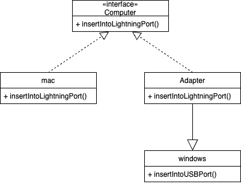

# Adapter 適配器模式

`Computer`為共用接口，而`mac`可以直接實作`Computer`，但windows無法直接實作`Computer`，這時候就需要一個介面，透過這個介面，windows去實作`Computer`，這就是所謂的適配器(Adapter)模式。

下面可以用個更明確栗子進行說明，在電壓110v是我們生活中最常見的電壓，市面上多數的電器也都是使用這種電壓，然後像是手機或筆記型電腦卻不需多這麼高的電壓，可是卻沒有專門用於這種電壓的插座，就是就需要所謂的`Adapter`，可以將110v轉換成裝置或電器需要的電壓。